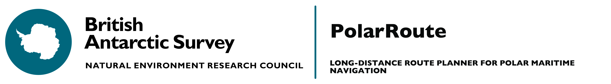

<a href="https://colab.research.google.com/drive/12D-CN10X7xAcXn_df0zNLHtdiiXxZVkz?usp=sharing">
<a href="https://antarctica.github.io/PolarRoute/">
<a href="https://pypi.org/project/polar-route/">
<a href="https://github.com/antarctica/PolarRoute/tags"></a>
<a href="https://github.com/antarctica/PolarRoute/issues"></a>
<a href="https://github.com/antarctica/PolarRoute/blob/main/LICENSE"></a>

# PolarRoute
> PolarRoute is a long-distance maritime polar route planning, taking into account complex changing environmental conditions. The codebase allows the construction of optimised routes through three main stages: discrete modelling of the environmental conditions using a non-uniform mesh, the construction of mesh-optimal paths, and physics informed path smoothing. In order to account for different vehicle properties we construct a series of data driven functions that can be applied to the environmental mesh to determine the speed limitations and fuel requirements for a given vessel and mesh cell, representing these quantities graphically and geospatially.

## Installation
The PolarRoute software requires GDAL files to be installed. The PolarRoute software can be installed on Windows by running the required wheels for GDAL and FIONA. MOre information can be found in the manual pages linked above. Once these requirements are met then the software can be installed by:

Github:
```
python setup.py install
```

 Pip: 
```
pip install polar-route
```

## Required Data sources
Polar-route has been built to work with a variety of open-source climactic data sources. 
A list of supported data sources and there associated data-loaders is given in the 
'Data Loaders' section of the manual

## Developers
Jonathan Smith, Samuel Hall, George Coombs, James Byrne,  Michael Thorne, Maria Fox

## License
This software is licensed under a MIT license. For more information please see the attached ``LICENSE`` file.

[version]: https://img.shields.io/PolarRoute/v/datadog-metrics.svg?style=flat-square
[downloads]: https://img.shields.io/PolarRoute/dm/datadog-metrics.svg?style=flat-square