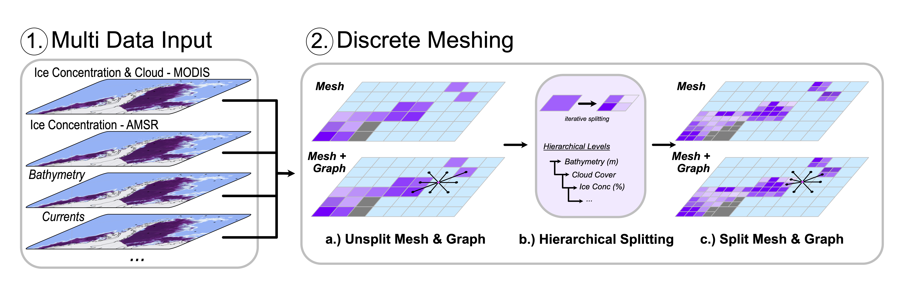

Documentation for the Code
**************************
.. role:: underline     :class: underline 

.. toctree::
   :maxdepth: 2
   :caption: Contents:

.. =====================================================================================================================
.. =====================================================================================================================
.. =====================================================================================================================
Background
====================
Overview
-----------------
We present an automated route-planning method for use by an ice-strengthened vessel operating as both a supply ship and a research vessel in polar regions. We build on the method developed for underwater vehicle long-distance route planning reported in~\cite{Fox2021}. We start with the same grid-based route construction approach to obtain routes that satisfy constraints on the performance of the ship in ice. We then apply a novel route-smoothing method to the resulting routes, shortening the grid-based routes and ensuring that routes follow great circle arcs where possible. This two-stage process efficiently generates routes that follow standard navigation solutions in open water and optimise vessel performance in and around areas dominated by sea ice.  While we have focussed on navigation in and around polar ice, our methods are also applicable to shipping in a broader context (e.g.: commercial shipping) where route-planning must be responsive to changing local and weather conditions.

Code Structure
-----------------
The outline of this manual is to provide the user with all the tools that they need to run the software for a theory of examples. We also hope that the background information supplied for each section allows the user to understand the methods used throughout this toolkit. 

The outline of the toolkit can be separted into the four main sections demonstrated in the Figure below

.. figure:: ./Figures/FlowDiagram_Overview.png
    :align: center

    Overview figure outlining the stages in the RoutePlanner

The separate stages can be broken down into:

1. **Multi Data Input** - Reading in different datasets of differening types. Throughout this section we will outline the form that the input datasets should take and useful tips for pre-processing your data of interest
2. **Discrete Meshing** - Generating a Digitial Twin of the environmental condtions. In this section we outline the different Python classes that are used to constucted a discretised represention across the user defined datasets, giving a coding background into the dynamic splitting of the mesh to finer resolution in regions of datasets that are spatially varying
3. **Vehicles Specifics** - Application of vehicle specific features applied to the discret mesh. In this section we will supply the user with the knowledge of how vehcile specific features are applied to the discret mesh or with varibles applied to the computational graph of the mesh. 
4. **Route Planning** - Generating grid-based dijkstra paths and data constrained path smoothing from the gridded solutions - In this section we will give the user the background to constructing paths between user defined waypoints that minimise a specific objective function (E.g. Traveltime, Fuel). Once the gridded Dijkstra paths are formulated we outline a smoothing based procedure that uses the data information to generate non-gridded improved route paths.

In addition to the main section of the codebase we have also developed a series of plotting classes that allows the user to generate Interactive maps and static figures for the Mesh Features and Route Paths. These can be found in the `Plotting` section later in the manual. 

.. =====================================================================================================================
.. =====================================================================================================================
.. =====================================================================================================================
Installation
=====================

In this section we will outline the stages required to install the codebase depending on the users operating system. Please jump to the section of your corresponding OS.

Windows
----------

FILL

Linux
----------

FILL

MacOS Intel/ARM
----------

In this section we will outline the installation steps for installing the software package on a MacOS device. The software pacakge works on both Intel and ARM, with the installation stages being identical.

The first stage is installing a version of Python 3.9, if you don't have a working version. We suggest installing a working Anaconda distribution from https://www.anaconda.com/products/distribution#macos following the onscreen/webpage information of this stage. 

.. =====================================================================================================================
.. =====================================================================================================================
.. =====================================================================================================================
Multi Data Input
=====================

In this section we will discuss the formating for datasets to be read into the codebase...

.. =====================================================================================================================
.. =====================================================================================================================
.. =====================================================================================================================
Discrete Meshing
=====================
Overview
-----------------

Throughout this section we will outline the usecase for the Discrete Meshing of the environment. The two main functions used are `CellGrid` composed of a series of `CellBox` objects. 

The general overview for the method can be seen in 

    Overview figure of the Discrete Meshing from the multi-data input.

Class Information
-----------------

CellBox
^^^^^^^^^^^^^^^^^

**Module Information**

.. automodule:: RoutePlanner.CellBox

**Class Information**

.. autoclass:: RoutePlanner.CellBox.CellBox
   :members:

CellGrid
^^^^^^^^^^^^^^^^^

**Module Information**

.. automodule:: RoutePlanner.CellGrid

**Class Information**

.. autoclass:: RoutePlanner.CellGrid.CellGrid
   :members:

.. =====================================================================================================================
.. =====================================================================================================================
.. =====================================================================================================================
Vehicles Specifics
=====================

**Module Information**

.. automodule:: RoutePlanner.speed

**Class Information**

.. autoclass:: RoutePlanner.speed

.. =====================================================================================================================
.. =====================================================================================================================
.. =====================================================================================================================

Route Optimisation
=====================
In this section we will outline the construction of the route paths using the Mesh construction corrected to include the objective functions define and generated in the earlier section ...

This section relies on two classes 

**Module Information **

.. automodule:: RoutePlanner.speed

**Class Information**

.. autoclass:: RoutePlanner.speed
..   :members:

.. =====================================================================================================================
.. =====================================================================================================================
.. =====================================================================================================================

Examples
=====================

Configuration
------------------
In this section we will outline the standard structure for a configuration file used in all portions of the RoutePlanner software.

Outlined below is an example configuration file for running the RoutePlanner. Using this as a template we will go through each of the definitions in turn, descibing what each portion does with the subsections in the manual given by the main sections in the configuration file.
::
   {
   "Region": {
      "latMin": 50,
      "latMax": 89,
      "longMin": -180,
      "longMax": 180,
      "startTime": "2017-01-01",
      "endTime": "2017-02-01",
      "cellWidth":5,
      "cellHeight":2.5,
      "splitDepth":0
   },
   "Data_sources": [
   ],
   "Speed_Function":{
      "Mesh_Input_Filename": "./cellgrid_dataframe.csv",
      "Mesh_Output_Filename": "./cellgrid_dataframe_speed.csv"
      
   },
   "Vehicle_Info": {
      "Speed": 26.5,
      "Unit": "km/hr",
      "Beam": 24.0,
      "HullType":"slender",
      "ForceLimit":96634.5,
      "MaxIceExtent":80
   },
   "Route_Info": {
      "Mesh_Filename": "./cellgrid_dataframe_speed.csv",
      "Paths_Filename": "./paths_traveltime.json",
      "Smoothpaths_Filename":"./paths_traveltime_smooth.json",
      "Objective_Function":"traveltime",
      "Path_Variables": ["Fuel","traveltime"],
      "WayPoints": "./Waypoints.csv",
      "Source_Waypoints": ["Harwich"],
      "End_Waypoints": [],
      "Zero_Currents": true,
      "Variable_Speed": true,
      "Time_Unit":"days",
      "Early_Stopping_Criterion": true,
      "Save_Dijkstra_Graphs": false
   },

Region
^^^^^^^^^^^^^^^^^^
The region section gives detailed information for the construction of the Discrete Mesh. The main defintions are the bounding region and temporal portion of interest (`longMin`, `latMin`, `longMax`, `latMax`, `startTime`, `endTime`), but also the starting shape of the spatial grid cell boxes (`cellWidth`, `cellHeight`) is defined before splitting is applied to a max split depth level (`splitDepth`). Further detail in each parameter is given below:

::

   "longMin" = Minimum Longitude Edge Mesh (float, degress)
   "longMax" = Maximum Longitude Edge Mesh (float, degress) 
   "latMin" = Minimum Latitude Edge Mesh  (float, degrees)
   "latMax" = Maximum Latitude Edge Mesh  (float, degrees)
   "startTime" = Start Datetime of Time averaing (str, 'YYYY-mm-dd')
   "endTime"  = End Datetime of Time averaing   (str, 'YYYY-mm-dd')
   "cellWidth" = Initial Cell Box Width prior to splitting (float, degrees)
   "cellHeight" = Initial Cell Box Height prior to splitting (float, degrees)

Data Sources
^^^^^^^^^^^^^^^^^^
The data soruces describes the different intput datasets and the required homogenous splitting conditions to apply in a hieracical form. The splitting is applied in order of the data sources described. The standard structure of the Data sources takes the form of:

::
   
   "Data_sources": [
      {
         "path": "../../Data/depth_map.nc",
         "latName": "lat",
         "longName": "long",
         "values": [
         {
            "sourceName": "depth",
            "destinationName": "depth",
            "splittingCondition": {
               "threshold": -10,
               "lowerBound": 0.000,
               "upperBound": 1.0
            }
         }
         ]
      },
      ...
   ]

where the variables are as follows:

:: 

   "path"     = Path to dataset to load (str)
   "latName"  = Dataset varible name for the latitude information (str) 
   "longName" = Dataset variable name for the longitude information (str)
   "values"   = Splitting conditions to apply to the dataset on a specific defined variable (list)
   "sourceName"      = Dataset varible name within the origional dataset (str) 
   "destinationName" = Dataset varible output used within Mesh construction & later vehicles specs (str) 
   "splittingContion" = Dictionary composed of "threshold" (float), "lowerBound" (float) and "upperBound"(float). The defintion for setting the splitting condition can be found in the earlier Section on Discrete Meshing.

Python/iPython Notebooks
------------------

Discrete Mesh
^^^^^^^^^^^^^^^^^^
In this section outline an example usecase ...

::

   from RoutePlanner.CellGrid import CellGrid
   mesh = CellGrid(config)

This requires some definition of the datasets to load 

Vehicles Specifics
^^^^^^^^^^^^^^^^^^
In this section outline an example usecase ...

Route Optimisation
^^^^^^^^^^^^^^^^^^
In this section outline an example usecase ...

Command Line Execution
------------------
In the previous section we outlined how to run the codebase from within a Python file or in iPython notebooks. In this section we will outline how the code can be run directly from command line by passing a configuration file to a exicutable python file found in `./exec/` from the root directly. 

The command line execution

::

   python ./exec/routeplanner.py config.json 

In addition, within the exec folder there is the independet stages used within the route planner. These include:

* `meshing.py` - Discrete Meshing
* `vehiclespecs.py` - Vehicle Specifics
* `routes.py` - Route planning on pre-computed mesh and vehicle specifics.