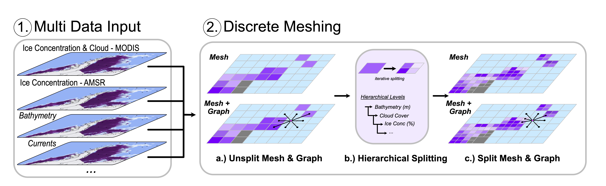

********
Mesh Construction
********

Overview
##############

Throughout this section we will outline the usecase for the Discrete Meshing of the environment. The two main functions used are `CellGrid` composed of a series of `CellBox` objects. 

The general overview for the method can be seen in 

    Overview figure of the Discrete Meshing from the multi-data input.

CellBox
##############

.. automodule:: RoutePlanner.CellBox

.. autoclass:: RoutePlanner.CellBox.CellBox
   :special-members: __init__
   :members: getcx, getcy, getdcx, getdcy, get_data_points, get_value, get_bounds, add_data_points, add_splitting_condition, value_should_be_split, value_hom_condition, hom_condition, should_split, split, contains_point, to_json

Mesh
##############

.. automodule:: RoutePlanner.CellGrid

.. autoclass:: RoutePlanner.CellGrid.CellGrid 
   :special-members: __init__  
   :members: add_data_points, get_cellbox, get_cellboxes, get_neighbour_case, split_and_replace, split_to_depth, to_json
