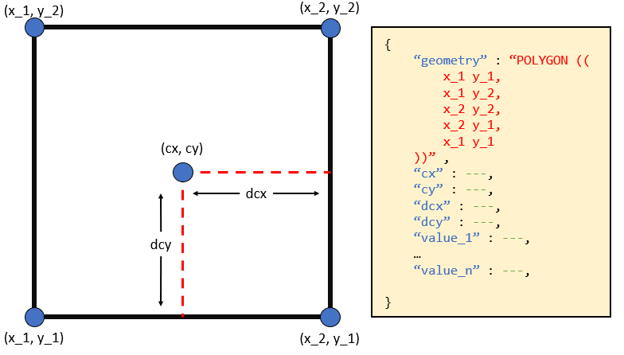
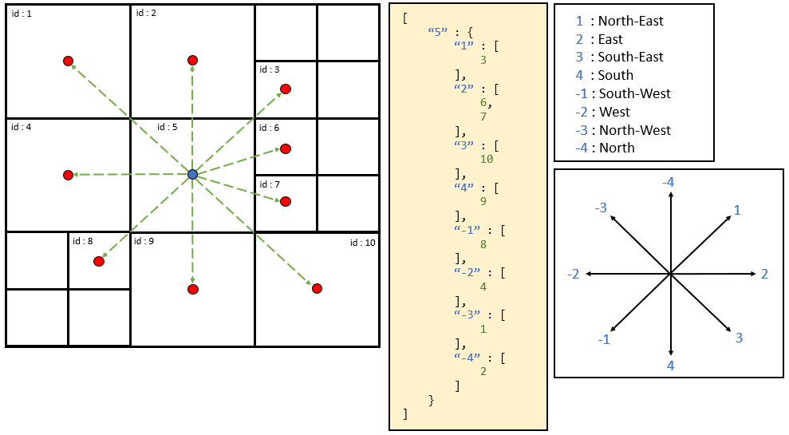

********
Outputs
********

#####
CellGrid construction
#####

The first stage in the route planning pipeline is constructing a discrete 
mesh of the enviroment in which the route planner can operate. Once this 
mesh is constructed, it can then be exported as a json object and passed 
down-stream to the vehicle specifics and route planner. An example 
of mesh construction and json object generation are as follows:

::

    from RoutePlanner.CellGrid import CellGrid

    with open('config.json', 'r') as f:
        config = json.load(f)

    mesh = CellGrid(config)
    mesh_json = mesh.to_json()

.. note:: 
    Examples and description of configuration files can be found in 
    the 'Configuration' section of this document.

The json object outputed by the CellGrid consist of 3 sections: **config**, 
**cellboxes** and **neighbour_graph**.

::

    {
        "config": {
            ...
        },
        "cellboxes": [
            {...},
            ...
            {...}
        ],
        "neighbour_graph": [
            "<id_1>": {
                ...
            },
            ...
            "id_n": {
                ...
            }
        ]
    }

where the parts of the json object are as follows:

* **config** : The configuration file used to generate the CellGrid
* **cellboxes** : A list of json representations of CellBox objects that form the CellGrid
* **neighbour_graph** : A graphical representation of the adjacency of CellBoxes within the CellGrid

=============
cellboxes
=============

Each CellBox object within *cellboxes* in the outputed json object is of 
the following form:

::

    {
        "id" (string): ...,
        "geometry" (string): ...,
        "cx" (float): ...,
        "cy" (float): ...,
        "dcx" (float): ...,
        "dcy" (float): ...,
        "<value_1>" (float): ...,
        ...
        "<value_n>" (float): ...
    }

Where the values within the CellBox represent the following:

* **id** : The index of the CellBox within the CellGrid
* **geometry** : The spatial boundaries of the CellBox
* **cx** : The x-position of the centroid of the CellBox, given in degrees latitude
* **cy** : The y-position of the centroid of the CellBox, given in degrees longitude
* **dcx** : The x-distance from the edge of the CellBox to the centroid of the CellBox. Given in degrees longitude.
* **dxy** : the y-distance from the edge of the CellBox to the centroid of the CellBox. Given in degrees latitude.

==================
neighbour_graph
==================

For each CellBox in the list *cellboxes* section of the outputed json object, there will be a
corresponding entry in the *neighbour_graph*.

.. note::
    Onces vehicle accessibility is applied to the outputed json object, this may no longer be true
    as inaccessible CellBoxes will be removed from *neighbour_graph* but will remain in *cellboxes*

Each entry in the *neighbour_graph* is of the following form:

:: 

    "<id>": {
        "1": [...],
        "2": [...],
        "3": [...],
        "4": [...],
        "-1": [...],
        "-2": [...],
        "-3": [...],
        "-4": [...]
    }

where each of the values represent the following: 

* **<id>** : The id of a CellBox within *cellboxes*
    * **1**  : A list of id's of CellBoxes within *cellboxes* to the North-East of the CellBox specifed by 'id'
    * **2**  : A list of id's of CellBoxes within *cellboxes* to the East of the CellBox specifed by 'id'
    * **3**  : A list of id's of CellBoxes within *cellboxes* to the South-East of the CellBox specifed by 'id'
    * **4**  : A list of id's of CellBoxes within *cellboxes* to the South-West of the CellBox specifed by 'id'
    * **-1** : A list of id's of CellBoxes within *cellboxes* to the South of the CellBox specifed by 'id'
    * **-2** : A list of id's of CellBoxes within *cellboxes* to the South-West of the CellBox specifed by 'id'
    * **-3** : A list of id's of CellBoxes within *cellboxes* to the North-West of the CellBox specifed by 'id'
    * **-4** : A list of id's of CellBoxes within *cellboxes* to the South of the CellBox specifed by 'id'

#####
Vehicle_specifics
#####

Once a discrete mesh enviroment is contructed, it is then passed to the vessel performance object 
apply transformation which are specifc to a given vehicle. 

:: 

    from RoutePlanner.CellGrid import CellGrid
    from RoutePlanner.vessel_performance import VesselPerformance

    with open('config.json', 'r') as f:
        config = json.load(f)

    mesh = CellGrid(config)
    mesh_json = mesh.to_json()

    vp = VesselPerformance(mesh_json)
    vessel_mesh_json = vp.to_json()

.. note::
    To be compatable with vessel performance transformations, a CellGrid must be contructed with
    the following attributes:
    
    * SIC
    * uC 
    * vC 
    * thickness
    * density

TODO - Description of transformation applied to the mesh json object by Vessel Performance.

#####
Route planning
#####

TODO - Description of tranformation applied to mesh json by Route Planner