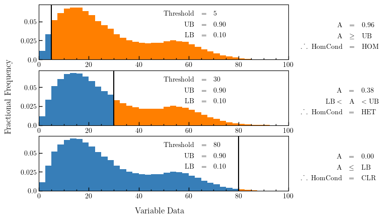

^^^^^^^^^^^^^^^^^^^^^^^^^^^^^^^^^^^^^^^^^^^^^^^^
Configuration - Mesh Construction
^^^^^^^^^^^^^^^^^^^^^^^^^^^^^^^^^^^^^^^^^^^^^^^^
.. code-block:: json
    
    {
        "Mesh_info": {
            "Region": {
                "latMin": -65,
                "latMax": -60,
                "longMin": -70,
                "longMax": -50,
                "startTime": "2013-03-01",
                "endTime": "2013-03-14",
                "cellWidth": 5,
                "cellHeight": 2.5
            },
            "Data_sources": [
                {
                    "loader": "GEBCO",
                    "params": {
                        "downsample_factors": [
                            5,
                            5
                        ],
                        "file": "../datastore/bathymetry/GEBCO/gebco_2022_n-40.0_s-90.0_w-140.0_e0.0.nc",
                        "data_name": "elevation",
                        "value_fill_types": "parent",
                        "aggregate_type": "MAX",
                        "splitting_conditions": [
                            {
                                "elevation": {
                                    "threshold": -10,
                                    "upper_bound": 1,
                                    "lower_bound": 0
                                }
                            }
                        ]
                    }
                },
                {
                    "loader": "AMSR",
                    "params": {
                        "folder": "../datastore/sic/amsr_south/",
                        "hemisphere": "south",
                        "value_fill_types": "parent",
                        "data_name": "SIC",
                        "splitting_conditions": [
                            {
                                "SIC": {
                                    "threshold": 35,
                                    "upper_bound": 0.9,
                                    "lower_bound": 0.1
                                }
                            }
                        ]
                    }
                },
                {
                    "loader": "SOSE",
                    "params": {
                        "file": "../datastore/currents/sose_currents/SOSE_surface_velocity_6yearMean_2005-2010.nc",
                        "value_fill_types": "parent",
                        "data_name": "uC,vC",
                        "splitting_conditions": [
                            {
                                "uC,vC": {
                                    "curl": 0.04
                                }
                            }
                        ]
                    }
                },
                {
                    "loader": "thickness",
                    "params": {
                        "data_name": "thickness",
                        "file": "",
                        "value_fill_types": "parent"
                    }
                },
                {
                    "loader": "density",
                    "params": {
                        "data_name": "density",
                        "file": "",
                        "value_fill_types": "parent"
                    }
                }
            ],
            "splitting": {
                "split_depth": 4,
                "minimum_datapoints": 5
            }
        }

    }

The configuration file used for mesh construction contains information required to build the discretised environment in which the route planner
operates. Information here dictates the region in which the mesh is constructed, the data contained within
the mesh and how the mesh is split to a non-uniform resolution. The configuration file used to generate a mesh is stored in a section titled 'Mesh_info'

The 'Mesh_info' section of the configuration file contains three primary sections:

################
Region
################
The region section gives detailed information for the construction of the Discrete Mesh. The main definitions are the bounding region and temporal portion of interest (`longMin`, `latMin`, `longMax`, `latMax`, `startTime`, `endTime`), but also the starting shape of the spatial grid cell boxes (`cellWidth`, `cellHeight`) is defined before splitting is applied. Further detail on each parameter is given below:

::

   "Region": {
      "latMin": -77.5,
      "latMax": -55,
      "longMin": -120,
      "longMax": -10,
      "startTime": "2017-02-01",
      "endTime": "2017-02-14",
      "cellWidth":5,
      "cellHeight":2.5
   }
    
where the variables are as follows:

* **longMin**      *(float, degrees)*      : Minimum Longitude Edge Mesh
* **longMax**      *(float, degrees)*      : Maximum Longitude Edge Mesh
* **latMin**       *(float, degrees)*      : Minimum Latitude Edge Mesh  
* **latMax**       *(float, degrees)*      : Maximum Latitude Edge Mesh  
* **startTime**    *(string, 'YYYY-mm-dd')*   : Start Datetime of Time averaging 
* **endTime**      *(string, 'YYYY-mm-dd')*   : End Datetime of Time averaging   
* **cellWidth**    *(float, degrees)*      : Initial Cell Box Width prior to splitting 
* **cellHeight**   *(float, degrees)*      : Initial Cell Box Height prior to splitting 

.. note::
    Variables **startTime** and **endTime** also support reference to system time using 
    the keyword **TODAY** *e.g.* 

    "startTime": "TODAY" ,  "endTime": "TODAY + 5"

    "startTime": "TODAY - 3",  "endTime": "TODAY"

############
Data Sources
############

The 'Data Sources' section of the configuration file dictates which information will be added to the
mesh when constructed. Each item in the list of data sources represents a single data set to be added
to the mesh.

::

   "Data_sources": [
                {
                    "loader": "GEBCO",
                    "params": {
                        "downsample_factors": [
                            5,
                            5
                        ],
                        "file": "../datastore/bathymetry/GEBCO/gebco_2022_n-40.0_s-90.0_w-140.0_e0.0.nc",
                        "data_name": "elevation",
                        "value_fill_types": "parent",
                        "aggregate_type": "MAX",
                        "splitting_conditions": [
                            {
                                "elevation": {
                                    "threshold": -10,
                                    "upper_bound": 1,
                                    "lower_bound": 0
                                }
                            }
                        ]
                    }
                },
                {
                    "loader": "AMSR",
                    "params": {
                        "folder": "../datastore/sic/amsr_south/",
                        "hemisphere": "south",
                        "value_fill_types": "parent",
                        "data_name": "SIC",
                        "splitting_conditions": [
                            {
                                "SIC": {
                                    "threshold": 35,
                                    "upper_bound": 0.9,
                                    "lower_bound": 0.1
                                }
                            }
                        ]
                    }
                },
                {
                    "loader": "SOSE",
                    "params": {
                        "file": "../datastore/currents/sose_currents/SOSE_surface_velocity_6yearMean_2005-2010.nc",
                        "value_fill_types": "parent",
                        "data_name": "uC,vC",
                        "splitting_conditions": [
                            {
                                "uC,vC": {
                                    "curl": 0.04
                                }
                            }
                        ]
                    }
                },
                {
                    "loader": "thickness",
                    "params": {
                        "data_name": "thickness",
                        "file": "",
                        "value_fill_types": "parent"
                    }
                },
                {
                    "loader": "density",
                    "params": {
                        "data_name": "density",
                        "file": "",
                        "value_fill_types": "parent"
                    }
                }
            ]
   

where the variables are as follows:

* **loader** *(string)* : The name of the data loader to be used to add this data source to the mesh
      see the :ref:`abstractScalarDataloader doc page<dataloaders-overview>` for further information about the available data loaders.
* **params** *(dict)* : A dictionary containing optional parameters which may be required by the specified data loader in 'loader'. These parameters include the following:

   * **value_fill_types** *(string)* : Determines the actions taken if a cellbox is generated with no data. The possible values are either parent (which implies assigning the value of the parent cellbox), zero or nan.
   * **aggregate_type** *(string)* : Specifies how the data within a cellbox will be aggregated. By default aggregation takes place by calculating the mean of all data points within the CellBoxes bounds. *aggregate_type* allows this default to be changed to other aggregate function (e.g. MIN, MAX, COUNT).
   * **[scalar] splitting_conditions** *(list)* : The conditions which determine if a cellbox should be split based on a scalar dataset. 
      * **threshold** *(float)* : The threshold above or below which CellBoxes will be sub-divided to separate the datapoints into homogeneous cells.
      * **upperBound** *(float)* : A percentage normalised between 0 and 1. A CellBox is deemed homogeneous if greater than this percentage of data points are above the given threshold.
      * **lowerBound** *(float)* : A percentage normalised between 0 and 1. A Cellbox is deemed homogeneous if less than this percentage of data points are below the given threshold.
   * **[vector] splitting_conditions** *(list)* : The conditions which determine if a cellbox should be split based on a vector dataset. 
      * **curl** *(float)* : The threshold value above which a cellbox will split. Is calculated as the maximum value of **Curl(F)** within a cellbox (where **F** is the vector field).

.. note:: 
   Splitting conditions are applied in the order they are specified in the configuration file.

#########
Splitting
#########

Non-uniform mesh refinement is done by selectively sub-dividing cells. Cell 
sub-division is performed whenever a cell (of any size) is determined to be 
inhomogeneous with respect to a specific characteristic of interest such as 
SIC or ocean depth (this characteristic is defined as a splitting condition 
inside the data source's params as illustrated above). 

In the figure below, a graphical representation of the splitting 
decision making process is shown. In this, the blue histogram represents an 
arbitrary dataset, the orange histogram represents the values in the dataset 
that are greater than the threshold (and denoted 'A' in the formulae), the 
black line is the threshold value, 'UB' is the upper bound, and 'LB' is the 
lower bound. To be specific, this is a probability distribution, and hence the 
area under the orange curve 'A' is a decimal fraction of the total dataset 
(which would have an area of 1).

.. _splitting_fig:

   *Plot showing how cellbox homogeneity is decided*

* If the orange area :code:`A <= LB`, then the homogeneity condition is :code:`CLR`.
* If the orange area :code:`A >= LB`, then the homogeneity condition is :code:`HOM`.
* If the orange area :code:`LB < A < UB`, then the homogeneity condition is :code:`HET`.

:code:`CLR`, :code:`HOM`, and :code:`HET` are used to determine if a cellbox 
should be split or not. There is also a fourth homogeneity condition :code:`MIN` 
which is only triggered when the number of datapoints within the cellbox is lower 
than the minimum_datapoints specified in the config. The values are checked in this order:

#. :code:`MIN` - Do not split the cellbox
#. :code:`CLR` - Do not split the cellbox, but allow splitting if other datasets return :code:`HET`
#. :code:`HOM` - Do not split the cellbox
#. :code:`HET` - Split the cellbox

In the extreme case where :code:`UB = 1` and :code:`LB = 0`, the cellbox will 
always split if there are any datapoints above or below the UB/LB respectively. 
Imagining a plot similar to the figure above,

* If the histogram is entirely blue, :code:`return 'CLR'`
* If the histogram is entirely orange, :code:`return 'HOM'`
* If there's both colours, :code:`return 'HET'`

The splitting section of the Configuration file defines the splitting parameters that are *common* across all the data sources and determines how the CellBoxes that form the
Mesh will be sub-divided based on the homogeneity of the data points contained within to form a mesh
of non-uniform spatial resolution.
::

   "splitting": {
      "split_depth":4,
      "minimum_datapoints":5
    }

where the variables are as follows:

* **split_depth** *(float)* : The number of times the MeshBuilder will sub-divide each initial cellbox (subject to satisfying the splitting conditions of each data source)
* **minimum_datapoints** *(float)* : The minimum number of datapoints a cellbox must contain for each value type to be able to split

