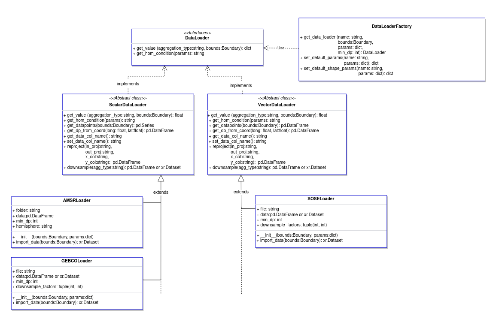

.. _dataloaders-overview:

*******************
Dataloader Overview
*******************

.. toctree::
   :maxdepth: 1
   :glob:

   ./DataLoaderInterface
   ./Factory
   ./scalar/index
   ./vector/index
   ./AddingDataloaders
   

Section Overview
################

In this section, we discuss the dataloader objects which retrieve data 
within a spatial (and optionally temporal) boundary for the Environmental Mesh.
The dataloaders are responsible for transforming the raw data into a format
that is interpretable by the mesh construction code. This may include reprojecting
to mercator (EPSG:4326) projection, or downsampling to reduce the computing resources
needed to process large datasets. Typically, raw data is stored as a NetCDF or CSV file,
however this can be whatever the user needs, so long as they are cast into either 
:code:`pandas.DataFrame`'s or :code:`xarray.Dataset`'s for the 
`Abstract Dataloaders`_ to work with.

   *UML Diagram detailing the dataloader subsystem*

Dataloader Types
================

There are two main types of dataloaders that are implemented as abstract classes: Scalar and Vector.

**Scalar dataloaders** are to be used on scalar datasets; i.e. variables with a single value
per latitude/longitude(/time) coordinate. Examples of this are bathymetry, sea ice concentration, etc... 
While the raw datasets may contain more than one variable (a common example being the existence of values and errors in the same file),
these *MUST* be cut down to just coordinates, and a single variable, in order to work correctly with the :ref:`abstractScalar<abstract-scalar-dataloader>` dataloader.
To read more on how to implement these, follow instructions in :ref:`Adding Dataloaders page<adding-dataloaders>` and the :ref:`abstract scalar dataloader page<abstract-scalar-dataloader-index>`.

**Vector dataloaders** are to be used on vector datasets; i.e. variables with multi-dimensional values
per latitude/longitude(/time) coordinate. Examples of this are ocean currents,
wind, etc... The datasets will have multiple data variables, and should be cut down to include only coordinates ('lat', 'long', 
and optionally 'time'), and the values for each dimensional component of the variable. This will generally be two dimensions, 
however the :ref:`abstractVector<abstract-vector-dataloader>` dataloader should be flexible to n-dimensional data. 
Rigor should be taken when testing these dataloaders to ensure that the outputs of :code:`get_value()` method of these dataloaders produces outputs that make sense.
To read more on how to implement these, follow instructions in :ref:`Adding Dataloaders page<adding-dataloaders>` and :ref:`abstract vector dataloader page<abstract-vector-dataloader-index>`.

.. **Look-up Table Dataloaders** are to be used on datasets where boundaries define a value.
.. Real data is always preferred to this method, however in the case where there is no data, the LUT
.. can provide an alternative. Examples of this include ice density, and ice thickness. For these examples,
.. weather conditions dictate their values, and these weather conditions can be localised to specific areas.
.. To read more on how to implement these, follow instructions in `Implementing New Dataloaders`_ and :ref:`abstract LUT dataloader page<abstract-lut-dataloader-index>`.

Abstract Dataloaders
====================
To look at specific abstract dataloaders, use the following links:

- :ref:`abstract-scalar-dataloader`
- :ref:`abstract-vector-dataloader`

These are the templates to be used when implementing new dataloaders into PolarRoute. 
They have been split into two separate categories: Scalar and Vector, detailed in `Dataloader Types`_.
The abstract classes generalise the methods used by each dataloader type to produce outputs
that the Environmental Mesh can retrieve via the  :ref:`dataloader interface<dataloader-interface>`. 
They are flexible in that they can store and process data as both :code:`xarray.Dataset`'s or 
:code:`pandas.DataFrame`'s (and by extension, :code:`dask.DataFrames`'s). 
When creating your own, :code:`dask` and :code:`xarray` should be utilised as much as possible to 
reduce memory consumption.

Both abstract base classes define the :code:`__init__()` function to have the following process:

#. Read in params from config
#. Add params from :code:`self.add_default_params()`, defined by user when creating a dataloader
#. Downsample data if required and if loaded as :code:`xarray.Dataset`
#. Reproject data if required
#. Trim datapoints to initial boundary
#. Rename data column name if defined in params