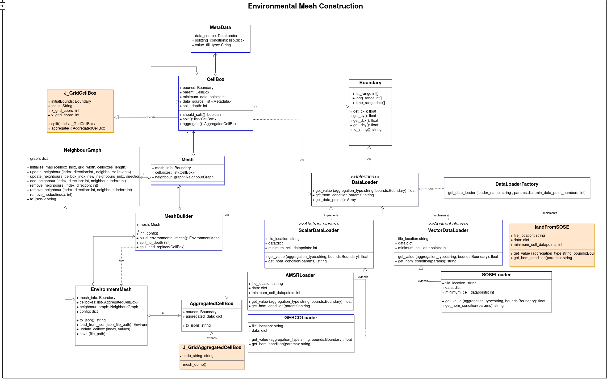
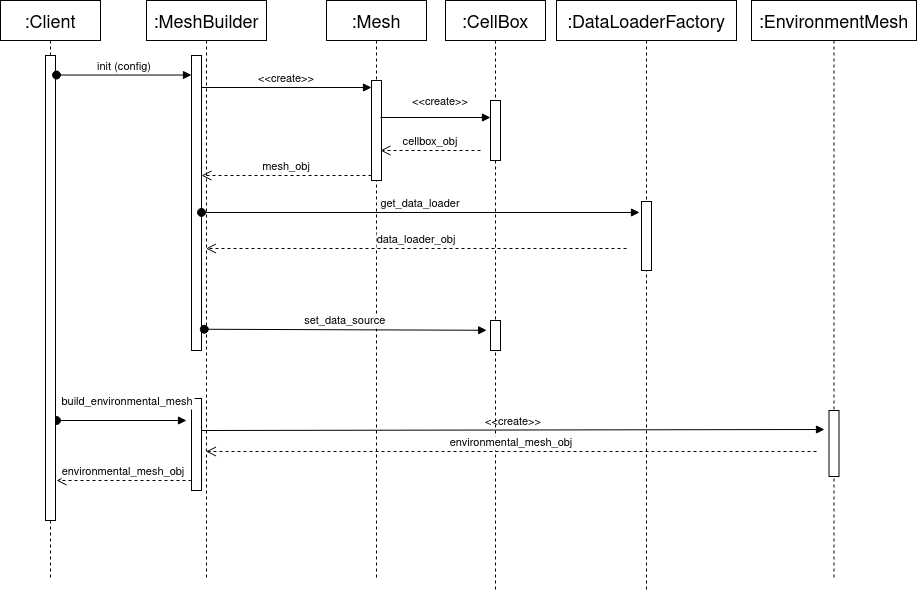
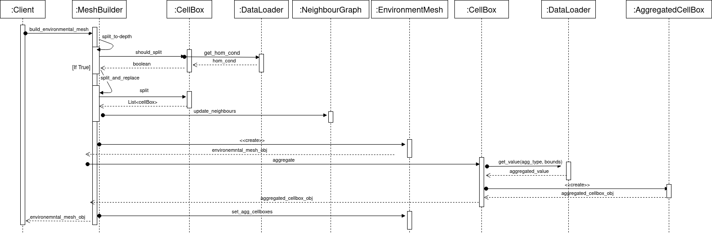

.. _mesh-construction:

********************************
Methods - Mesh Construction
********************************

Throughout this section we will outline an overview of the Environment Mesh Construction module, describe the main classes that composes the module and illustrate a use case for the Discrete Meshing of the environment.

Mesh Construction Overview
##############################
A general overview of the method can be seen below:

.. figure:: ./Figures/FlowDiagram_MeshGraph.png
    :align: center
    :width: 700

    Overview figure of the Discrete Meshing from the multi-data input.

Mesh Construction Design
##############################
The below UML diagram describes how the Environment Mesh Construction module is designed. It depicts the classes of the module and how they interact with each other.

 

Mesh Construction Use case
###################################
This sequence diagram illustrates a use case for the Discrete Meshing of the environment, where the module's client starts by initializing the MeshBuilder with a certain mesh configuration (see Input-Configuration section for more details about the configuration format) then calls build_environment_mesh method.

The following diagram depicts the sequence of events that take place inside build_environment_mesh method into details

Classes
##############
This section describes the main classes of the Mesh Construction module in details

CellBox
***************
.. automodule:: polar_route.mesh_generation.cellbox

.. autoclass:: polar_route.mesh_generation.cellbox.CellBox
   :special-members: __init__
   :members:  set_data_source, should_split, split, set_parent, aggregate

MetaData
***********

.. automodule:: polar_route.mesh_generation.metadata

.. autoclass:: polar_route.mesh_generation.metadata.Metadata
   :special-members: __init__
  

MeshBuilder
***********

.. automodule:: polar_route.mesh_generation.mesh_builder

.. autoclass:: polar_route.mesh_generation.mesh_builder.MeshBuilder
   :special-members: __init__  
   :members: build_environmental_mesh , split_and_replace, split_to_depth, add_dataloader

AggregatedCellBox
******************
.. automodule:: polar_route.mesh_generation.aggregated_cellbox

.. autoclass:: polar_route.mesh_generation.aggregated_cellbox.AggregatedCellBox
   :special-members: __init__
   :members:  contains_point, to_json

EnvironmentMesh
****************
.. automodule:: polar_route.mesh_generation.environment_mesh

.. autoclass:: polar_route.mesh_generation.environment_mesh.EnvironmentMesh
   :special-members: __init__  
   :members: load_from_json, update_cellbox , to_json, to_geojson, to_tif ,save

NeighbourGraph
***************

.. automodule:: polar_route.mesh_generation.neighbour_graph

.. autoclass:: polar_route.mesh_generation.neighbour_graph.NeighbourGraph
   :members: initialise_neighbour_graph, get_neighbour_case, update_neighbours