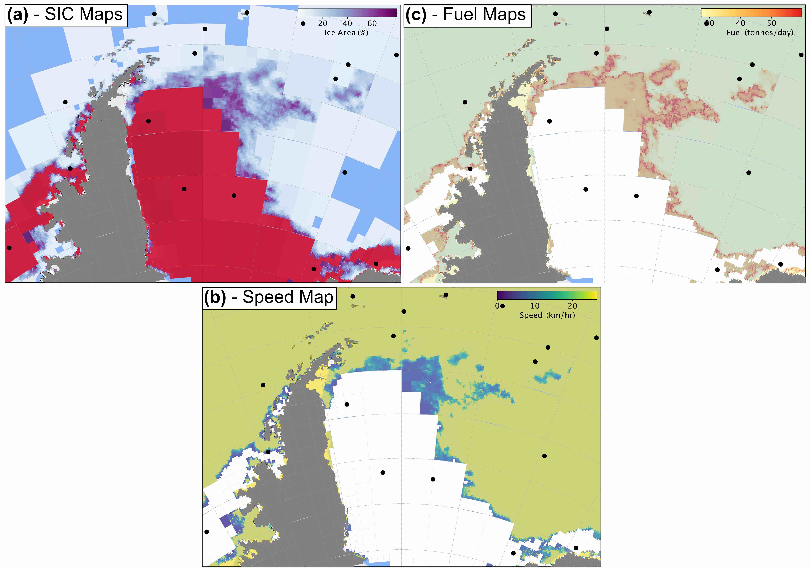

****************************
Methods - Vessel Performance
****************************

Vessel Overview
###############

All of the functionality that relates to the specific vehicle traversing our meshed environment model is contained within the vessel_performance directory.
This directory contains a `VesselPerformanceModeller` class that initialises one of the vessel classes in `vessels` and uses this to determine which cells
in a given mesh are inaccessible for that particular vessel and what its performance will be in each of the accessible cells.

    Maps of the sea ice concentration (a), speed (b) and fuel consumption (c) across the Weddell Sea.
    The latter two quantities are derived from the former.

Vessel Performance Modeller
###########################

.. automodule:: polar_route.vessel_performance.vessel_performance_modeller

.. autoclass:: polar_route.vessel_performance.vessel_performance_modeller.VesselPerformanceModeller
   :special-members: __init__
   :members: model_performance, model_accessibility, to_json

Vessel Factory
##############

.. automodule:: polar_route.vessel_performance.vessel_factory

.. autoclass:: polar_route.vessel_performance.vessel_factory.VesselFactory
   :members: get_vessel

Abstract Vessel
###############

.. automodule:: polar_route.vessel_performance.abstract_vessel

.. autoclass:: polar_route.vessel_performance.abstract_vessel.AbstractVessel
   :special-members: __init__
   :members: model_performance, model_accessibility

Abstract Ship
#############

.. automodule:: polar_route.vessel_performance.vessels.abstract_ship

.. autoclass:: polar_route.vessel_performance.vessels.abstract_ship.AbstractShip
   :special-members: __init__
   :members: model_performance, model_accessibility, land, extreme_ice

SDA
###

.. automodule:: polar_route.vessel_performance.vessels.SDA

.. autoclass:: polar_route.vessel_performance.vessels.SDA.SDA
   :special-members: __init__
   :members: model_speed, model_fuel, model_resistance, invert_resistance

