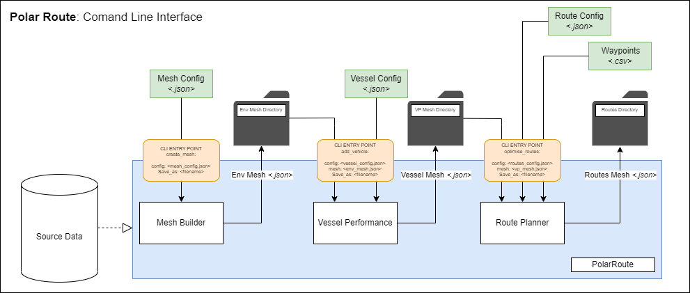

**********************
Runnning Codebase
**********************

The codebase current can be run from either pre-defined python functions or via a command line interface. Outlined below is how to run the separate sections of the software package using either of the two methods.

###############################
Command Line Interface
###############################

The PolarRoute package provides 4 CLI entry points, intended to be used in succession to plan a route through a digital enviroment.

   *Overview figure of the Command Line Interface entry points of PolarRoute*

^^^^^^^^^^^^^^^^^^
create_mesh
^^^^^^^^^^^^^^^^^^
The *create_mesh* entry point builds a digital enviroment file from a collection of source data, which can then be used 
by the vessel performance modeller and route planner. 

::

    create_mesh <config.json>

positional arguments:

::

    config : A configuration file detailing how to build the digital enviroment. JSON parsable

The format of the required *<config.json>* file can be found in the :ref:`Input - Configuration` section of the documentation.

optional arguments:

::

    -v (verbose logging)
    -o <output location> (set output location for mesh)

^^^^^^^^^^^^^^^^^^^^^^^^^^^^^^^^^^
add_vehicle
^^^^^^^^^^^^^^^^^^^^^^^^^^^^^^^^^^
The *add_vehicle* command allows vehicle specific simulations to be performed on the digital enviroment. This vehicle specific 
information is then encoded into the digital enviroment file.

::

    add_vehicle <vessel.json> <mesh.json>

positional arguments:

::

    vessel : A configuration file detailing the vessel to be simulated in the digital enviroment.
    mesh : A digital enviroment file.

The format for the required *<vessel.json>* file can be found in the :ref:`Input - Configuration` section of the documentation.
The required *<mesh.json>* file can be created using the :ref:`create_mesh` command shown above.

optional arguments are

::

    -v (verbose logging)
    -o <output location> (set output location for mesh)

^^^^^^^^^^^^^^^^^^
optimise_routes
^^^^^^^^^^^^^^^^^^
Optimal routes through a mesh can be calculated using the command:

::

    optimise_routes <vessel_mesh.json> <route_config.json> <waypoints.csv>

positional parameters:

::

    vessel_mesh : A digital enviroment file with added vessel specific simulations.
    route_config : A configuration file detailing optimisation parameters to be used when route planning.
    waypoints: A .csv file containing waypoints to be travelled between.

The format for the required *<route_config.json>* file can be found in the :ref:`Input - Configuration` section of the documentation.
The required *<vessel_mesh.json>* file can be generated using the :ref:`add_vehicle` command shown above.
The format for the requried *<waypoints.csv>* file is as follows:

As table:

+------------------+---------------+---------------+---------+---------------+
| Name             | Lat           | Long          | Source  | Destination   |
+==================+===============+===============+=========+===============+
| Halley           | -75.26722     | -27.21694     |         | X             |
+------------------+---------------+---------------+---------+---------------+
| Rothera          | -68.3892      | -95.2436      |         |               |
+------------------+---------------+---------------+---------+---------------+
| South Georiga    | -54.87916667  | -37.26416667  | X       |               |
+------------------+---------------+---------------+---------+---------------+
| Falklands        | -55.63472222  | -64.88        |         |               |
+------------------+---------------+---------------+---------+---------------+
| Elephant Island  | -60.54722222  | -55.18138889  |         |               |
+------------------+---------------+---------------+---------+---------------+

As .csv:

::

    Name,Lat,Long,Source,Destination
    Halley,-75.26722,-27.21694,,X
    Rothera,-68.3892,-95.2436,,
    South Georiga,-54.87916667,-37.26416667,X,
    Falklands,-55.63472222,-64.88,,
    Elephant Island,-60.54722222,-55.18138889,,

Additional waypoints may be added by extending the '<waypoints.csv>' file. Which waypoints are navigated between is determined by 
added a **X** in either the *Source* or *Destination* columns. When processed, the route planner will create routes from all 
waypoints marked with an **X** in the source column to all waypoints marked with a **X** in the *destination* column. 

optional arguments are

::

    -v (verbose logging)
    -o <output location> (set output location for mesh)
    -p (output only the caculated path, not the entire mesh)
    -d (output Dijkstra path as well as smoothed path)

^^^^^^^^^^^^^^^^^^
export_mesh
^^^^^^^^^^^^^^^^^^
Once a mesh has been built using the :ref:`create_mesh` command, it can be exported other file types for 
use in other systems (such as GIS software) using the the *export_mesh* command.

::

    export_mesh <mesh.json> <output_location> <output_format> 

positional arguments:

::

    mesh : A digital enviroment file.
    output_location : The location to save the exported mesh.
    output_format : The format to export the mesh to.

supported output formats are:
  * .json (default) [JSON]
  * geo.json (collection of polygons for each cell in the mesh) [GEOJSON]
  * .tif (rasterised mesh) [TIF]

optional arguments:

::

    -v : verbose logging
    -o : output location
    -format_conf: configuration file for output format (required for TIF export)

^^^^^^^^^^^^^^^^^^
Plotting
^^^^^^^^^^^^^^^^^^
Meshes produced at any stage in the route planning process can be visualised using the GeoPlot library found at `Link <https://github.com/antarctica/GeoPlot>` 

Python & iPython Notebooks
###############################

Route planning may also be done using a python terminal. This is case, the CLI is not required but the steps required for route planning 
follow the same format - create a digital enviroment; simulated a vessel against it; optimise a route plan through the digital enviroment.
 

^^^^^^^^^^^^^^^^^^^^^^^^^^^^^^^^^^^
Creating the digital enviroment.
^^^^^^^^^^^^^^^^^^^^^^^^^^^^^^^^^^^

A configuration file is needed to initialise the **`Mesh`** object which forms the digital enviroment. This configuration file 
is of the same format used in the :ref:`create_mesh` CLI entry-point, and may either be loaded from a *json* file or constructed 
within the python terminal.

Loading configuration from *json* file:
::

    import json
    with open('config.json', 'r') as f:
        config = json.load(f)    

The digital enviroment **`Mesh`** object can then be initialised. This mesh object will be constructed using parameters in it 
configuration file. This mesh object can be manipulated further, such as increasing its resolution through further 
splitting, adding additional data sources or altering is configuration parameters using functions listed in 
the :ref:`Methods - Mesh Construction` section of the documentation.
::

   from polar_route.mesh import Mesh
   cg = Mesh(config)
   
The digital enviroment **`Mesh`** object can then be cast to a json object and saved to a file. This *mesh.json* file can then 
be used by the CLI entry-point :ref:`add_vehicle`, or the json object can be passed to the **`VesselPerformance`** object in a python 
terminal.
::

    mesh = cg.to_json()
    with open('mesh.json') as f:
        json.dumps(mesh)

^^^^^^^^^^^^^^^^^^^^^^^^^^^^^^^^^^^^^^^^^^^^^
Simulating a Vessel in a Digital Enviroment
^^^^^^^^^^^^^^^^^^^^^^^^^^^^^^^^^^^^^^^^^^^^^

Once a digital enviroment **`Mesh`** object has been created, how a vessel interacts with it may be simulated. The **`VesselPerformance`** 
object requires a digital enviroment in *json* format and vessel specific configuration parameters, also in *json* format. These may either 
be loaded from a file, or created within the python terminal.

Loading mesh and vessel from *json* files:
::

    import json
    # Loading digital enviroment from file
    with open('mesh.json', 'r') as f:
        mesh = json.load(f)  

    # Loading vessel configuration parameters from file
    with open('vessel.json', 'r') as f:
        vessel = json.load(f) 

The **`VesselPerformance`** object can then be initialised. This will simulate the performance of the vessel and encodes this information 
into the digital enviroment.
::

   from polar_route.vessel_performance import VesselPerformance
   vp = VesselPerformance(mesh, vessel)

The **`VesselPerformance`** object can then be cast to a json object and saved to a file. This *vessel_mesh.json* file can then 
be used by the CLI entry-point :ref:`optimise_routes`, or the json object can be passed to the **`RoutePlanner`** object in a python 
terminal.
::

    vessel_mesh = vp.to_json()
    with open('vessel_mesh.json') as f:
        json.dumps(vessel_mesh)

^^^^^^^^^^^^^^^^^^^^^^^^^^^
Route Optimisation
^^^^^^^^^^^^^^^^^^^^^^^^^^^
Now that the vessel dependent environmental mesh is defined, and represented in the `vessel_performance` object, we can 
construct routes, with parameters defined by the user in the configuration file. Waypoints are passed as an input 
file path, `waypoints.csv`, discussed more in the Inputs section of the manual pages.  The route construction is done 
in two stages: construction of the meshed dijkstra optimal routes, `.compute_routes()`; and, the smoothing of the 
dijkstra routes to further optimise the solution and reduce mesh dependencies, `.compute_smooth_routes()`. 
During `.compute_routes()` the paths are appended to the object as an entry `paths`, which are replaced by the 
smoothed paths after running `.compute_smooth_routes()`. An additional entry `waypoints` is generated to give the 
waypoints information used in route construction. For further info about the structure of the outputs of the 
paths please see the Outputs section of the manual.

::

    from polar_route.route_planner import RoutePlanner
    rp = RoutePlanner(vessel_mesh, route_config , waypoints)
    rp.compute_routes()
    rp.compute_smoothed_routes()
    info = rp.to_json()

